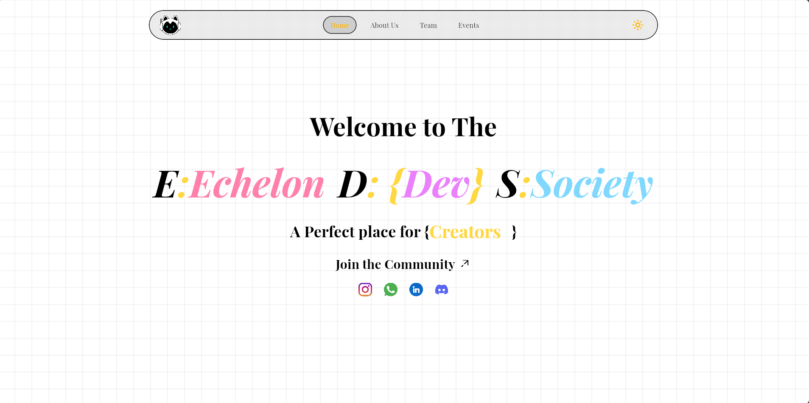
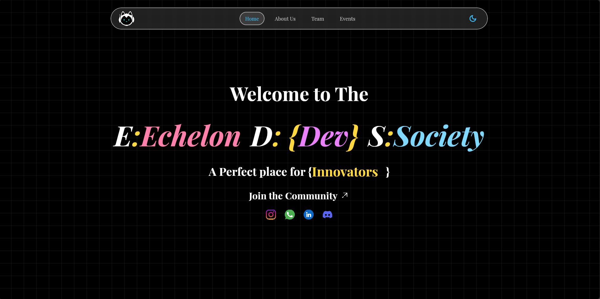
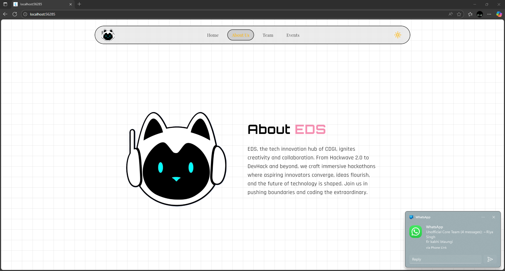
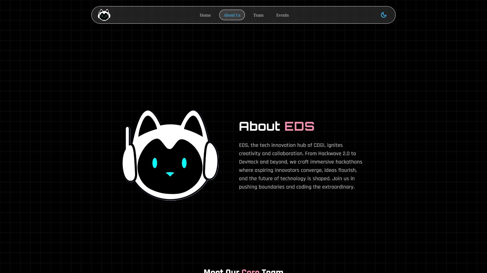
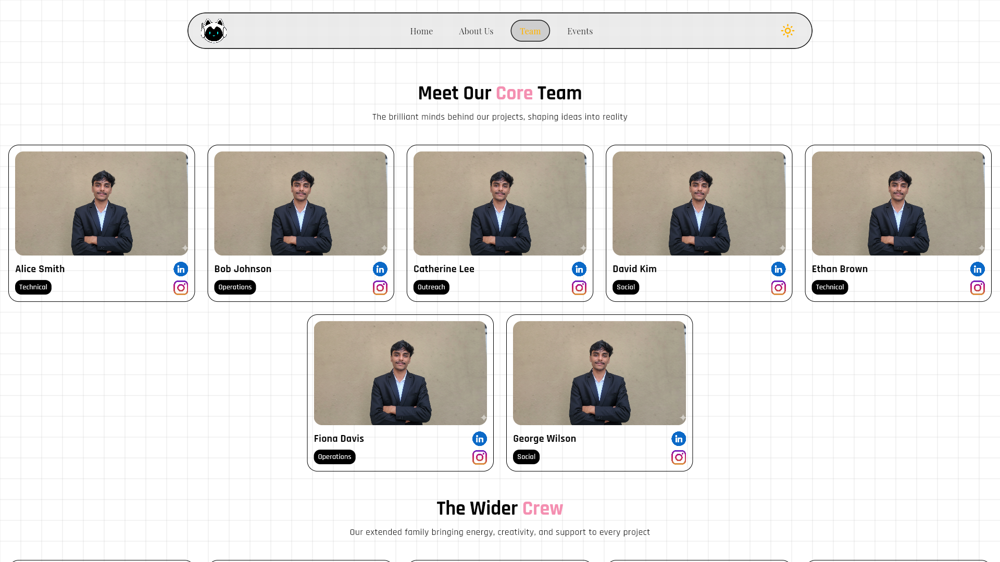
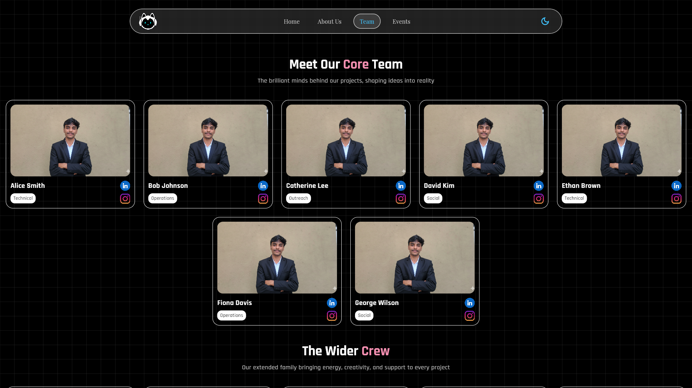
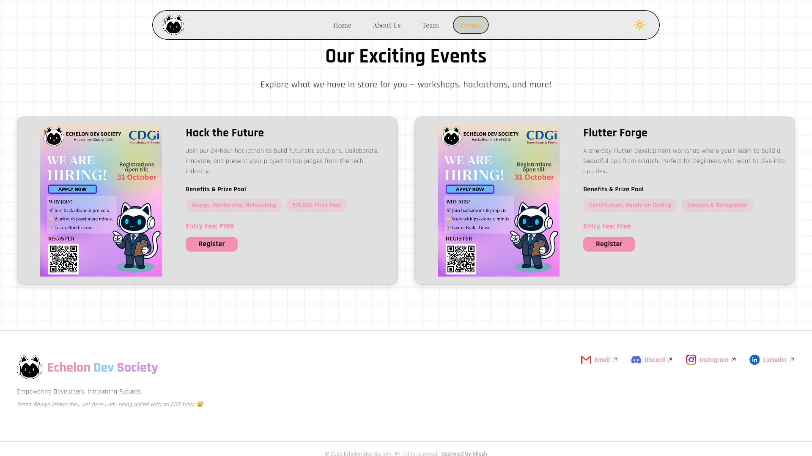
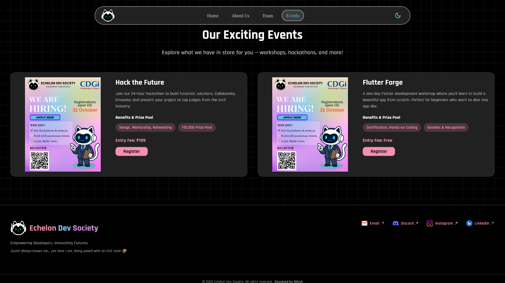

<!--
  README.md for Echelon Dev Society Landing Page
-->

# 📌 Echelon Dev Society - Landing Page

Welcome! This is a **fully responsive landing page** for **Echelon Dev Society (EDS)**, created as a task to demonstrate frontend development skills.

Built entirely with **Flutter Web** and deployed on **Vercel**. Works on **Web, Android, and iOS**.

---

## 🚀 Live Project

Experience the project in action:  
[➡ Visit Live Project ⬅](https://nilesheds.vercel.app/)

---

## 📸 Project Screenshots

<table>
  <tr>
    <th>Light Theme</th>
    <th>Dark Theme</th>
  </tr>
  <tr>
    <td></td>
    <td></td>
  </tr>
  <tr>
    <td></td>
    <td></td>
  </tr>
  <tr>
    <td></td>
    <td></td>
  </tr>
    <tr>
    <td></td>
    <td></td>
  </tr>
</table>

---

## 🛠️ Features

- 🌍 **Cross-Platform:** Web, Android, iOS  
- ⚡ **Fast & Lightweight:** Optimized Flutter Web app  
- 🎨 **Modern UI:** Clean, interactive, responsive interface  
- 📁 **Core Sections:** Header, About, Team, Event , Footer  
- 🔄 **Dark/Light Mode:** Adaptive color themes  
- 📦 **Animations:**  cards animate when scrolled into view  

---

## 🧑‍💻 Tech Stack

- **Framework:** Flutter  
- **Hosting:** Vercel  
- **Languages:** Dart, HTML/CSS  
- **Platforms:** Web, Android, iOS  

---

## 📅 Task Details

Your task was:

1. **Create a Landing Page** for Echelon Dev Society.  
2. Include the following sections:
   - Header with logo, nav bar, hero banner
   - About EDS
   - Events/Projects showcase
   - Team members
   - Footer with social links and GitHub  
3. Implement **responsive design**.  
4. Bonus: Dark/Light mode toggle  

I implemented all requirements using **Flutter Web**, including animations and responsive layouts.

---

## 🎯 Why This Project?

This project was done as a **task to join Echelon Dev Society (EDS)**. It demonstrates:

- Ability to build **fully responsive UI**  
- Proficiency with **Flutter Web**  
- Design, creativity, and attention to detail  

> Fun Fact: Sumit Bhaiya knows me… yet here I am, being poked with an EDS task! 😅

---

## 💡 Learning & Experience

- 🚀 Best practices in Flutter development  
- 🌐 Deployment on Vercel  
- 📱 Responsive app design for multiple platforms  
- ⚡ Performance optimization  
- 💻 UI/UX improvements  

---

## 🔗 Connect With Me

- 📷 Instagram: [@nilesh__pr_](https://www.instagram.com/nilesh__pr_/)  
- 💼 Work Instagram: [@its.nilesh_pr](https://www.instagram.com/its.nilesh_pr/)  
- 👨‍💻 LinkedIn: [Nilesh Prajapat](https://www.linkedin.com/in/nilesh-prajapat)  
- 🐙 GitHub: [nilesh-prajapat](https://github.com/nilesh-prajapat)  

---

© 2025 Nilesh Prajapat | All Rights Reserved

